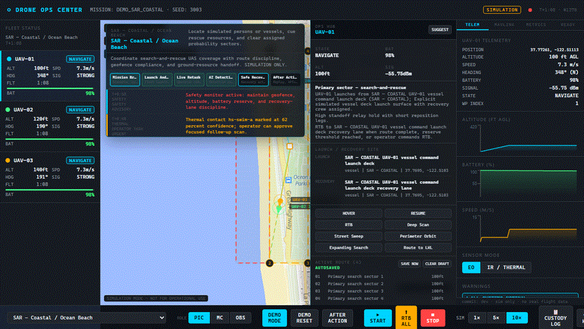
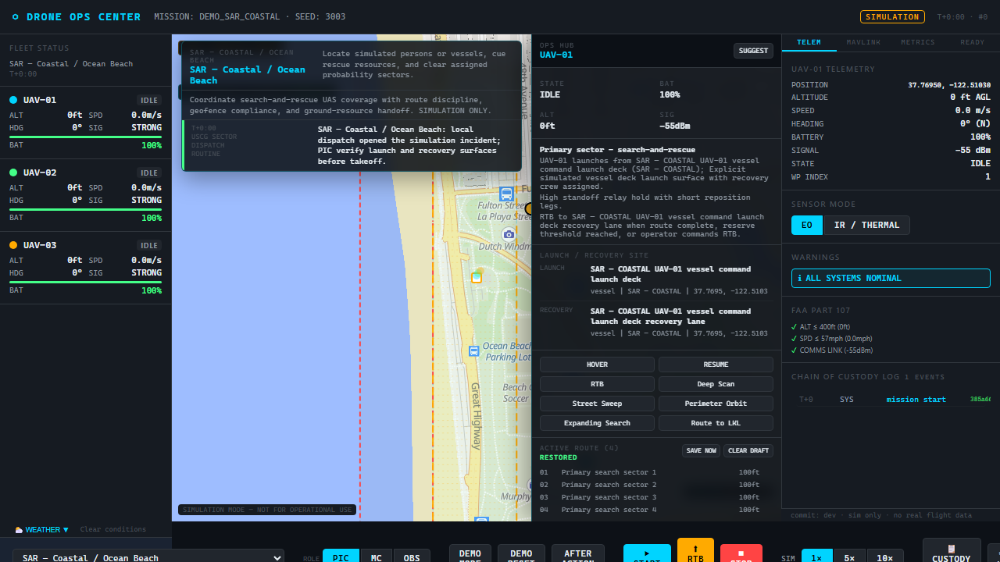
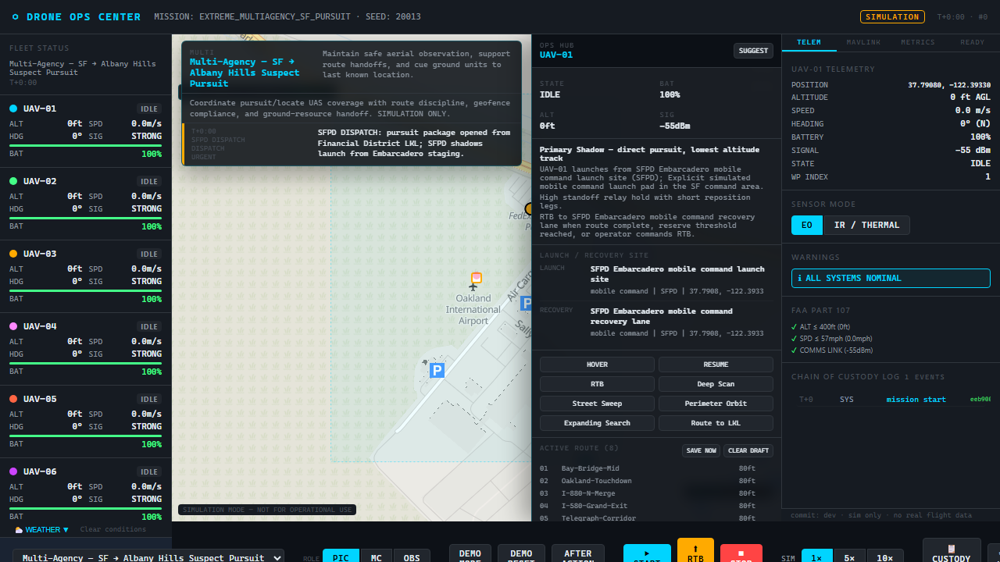
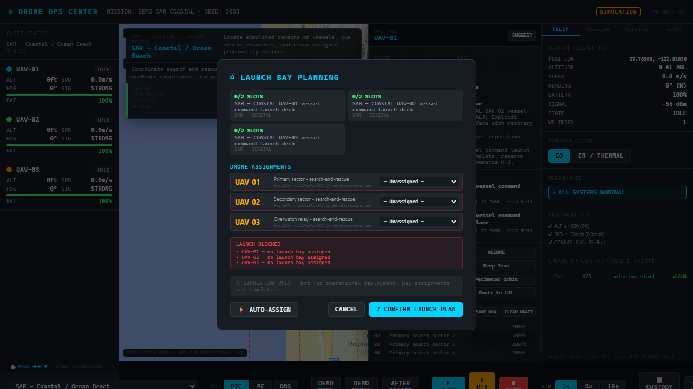
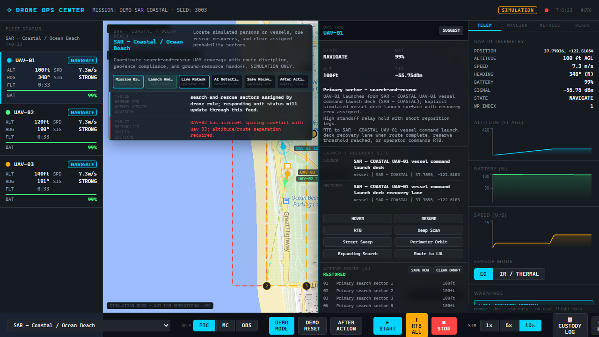
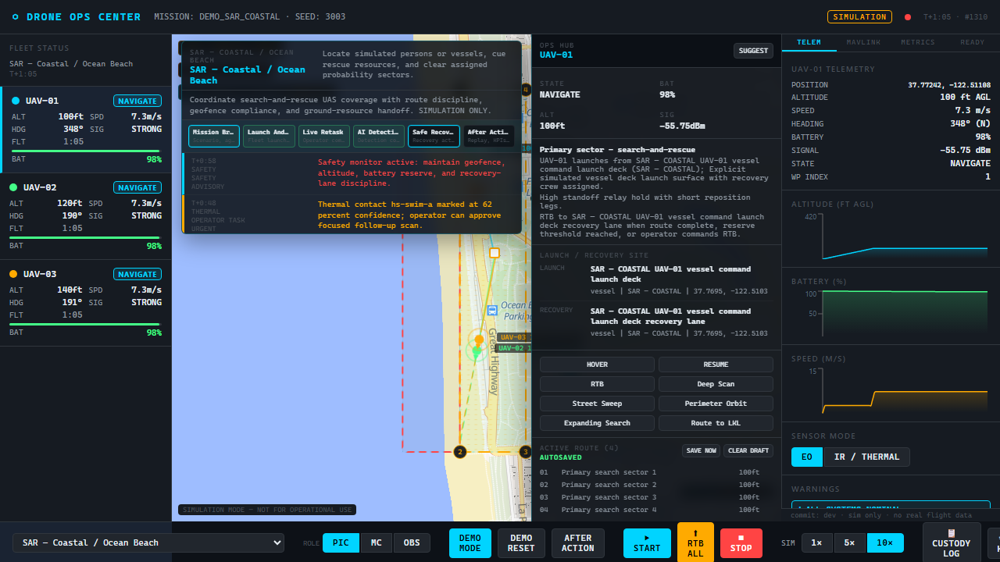
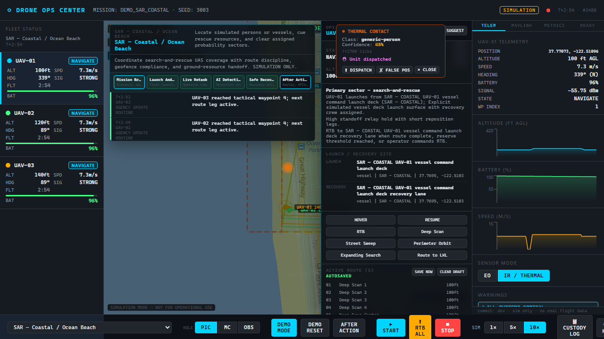
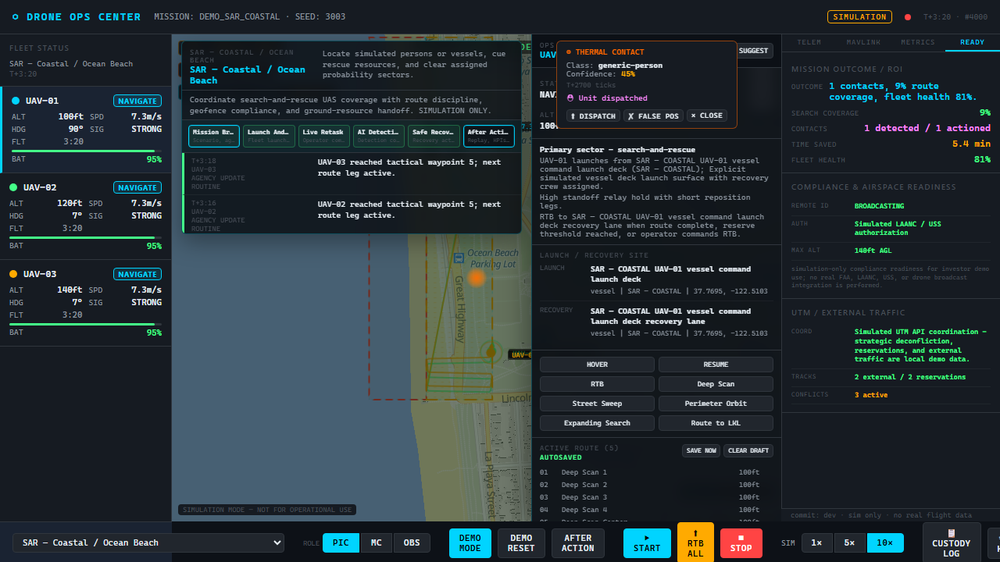
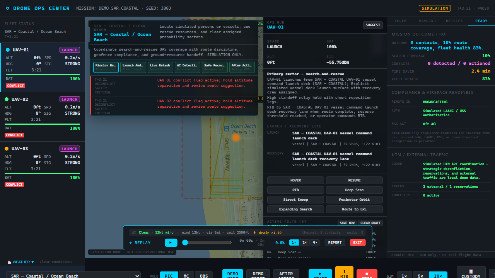

# Autonomous Drone Simulator

**Browser-only. Simulation-only. No real aircraft.**

A local-first React + TypeScript simulator for the multi-drone public-safety missions a human operator **supervises** — plan, preflight, launch, retask, thermal contacts, readiness, replay, and export — without wiring anything to live drones or aviation systems.



| Try it now | Open |
|---|---|
| **Mobile** | **[Launch Mobile](https://autonomous-drone-simulator-mobile.vercel.app/)** — phone or tablet |
| **Windows** | **[Launch Windows](https://autonomous-drone-simulator.vercel.app/)** — Windows PC only |
| **Classroom (UI demo)** | **[Classroom home](https://autonomous-drone-simulator-classroom.vercel.app/)** — accounts + instructor/student UI |

> **Live multi-student class?** The Vercel classroom link is a **client showcase**. A real class on your Wi‑Fi needs one instructor machine running `npm run classroom` — step-by-step below.

---

## What you get in one glance

- **Full mission arc** — scenario → preflight → launch → retask → thermal → ready → replay → export  
- **Autonomy on a leash** — route suggestions wait for accept/reject; nothing reroutes behind your back  
- **Deterministic sim** — same seed → same mission (honest demos and classroom grading)  
- **Three builds, one repo** — Mobile, Windows, Classroom  
- **Classroom mode** — instructor wall + student sims, end-to-end encrypted on your LAN  

On Mobile or Windows, tap **▶ LAUNCH DEMO** on the welcome screen for a guided mission.

Windows is platform-locked: open it on a non-Windows device and you get **ERROR — WINDOWS VERSION ONLY** with a path to Mobile.

Accounts stay in **that browser’s storage** — nothing is uploaded; Mobile / Windows / Classroom do **not** share logins.

---

## Run a classroom session (instructor + students)

**Who this is for:** a teacher, club lead, or anyone hosting a class. Students only need a browser on the same Wi‑Fi.

**You need:** Node.js **20+**, this repo, and one computer that stays on (the instructor machine).

### Step 1 — Install once (instructor machine)

```bash
git clone https://github.com/loganlewisw1112-create/Autonomous-Drone-Simulator.git
cd Autonomous-Drone-Simulator
npm install
```

### Step 2 — Instructor unlock material (maintainers only)

Instructor signup needs a one-time supervised access code. The expected SHA‑256 digest is **not** in git.

1. Create folder `local-secrets/` (already gitignored).  
2. Put your 64‑character hex digest in `local-secrets/instructor-access-hash.txt` (non-comment line).  
3. Keep the plaintext code only in `local-secrets/instructor-access-code.txt` on that machine — **never commit it**.

If you are a student: skip this. Your teacher gives you the unlock code when you create an instructor account (or they create it for you).

### Step 3 — Start the classroom server

```bash
npm run classroom
```

Wait until you see something like:

```text
Classroom relay on http://localhost:8080
Classroom relay on http://192.168.x.x:8080
```

Leave this terminal open. Closing it ends the class for everyone.

### Step 4 — Instructor (same machine or another device on the Wi‑Fi)

1. Open the LAN URL printed above (on the instructor PC: `http://localhost:8080`).  
2. Create or sign in as an **Instructor** account.  
3. Open **Start a training class** (`?coordinator=1` if you need the direct link).  
4. New instructors: enter the supervised **Insert access code here** once → Finish account setup.  
5. Choose scenario / seed → **Create class**.  
6. Note the **6‑character class code** and show students the join URL (same host, join flow).

### Step 5 — Students (phones, laptops, tablets on the same Wi‑Fi)

1. Open the instructor’s LAN address (for example `http://192.168.x.x:8080` — use the IP from Step 3, not `localhost` on their phone).  
2. Create or sign in as a **Student** account (open signup).  
3. Enter the **6‑character class code** and join.  
4. Fly the mission on their device; the instructor wall watches the class.

### Step 6 — End class

Instructor ends the class from the console. Per‑student progress is archived into the instructor’s **encrypted on‑device** classroom history (that browser + that instructor password).

### Quick rules (read once)

| Do | Don’t |
|---|---|
| Keep `npm run classroom` running during class | Expect a live multi‑student class on Vercel alone |
| Put students on the **same Wi‑Fi** as the instructor PC | Ask students to open `localhost` on their phones |
| Give instructors the unlock code **offline** | Put unlock codes in README, git, or chat logs you publish |
| Use Student accounts for learners | Use Instructor unlock for every student |

Hosted UI tour (no live relay): [Classroom home](https://autonomous-drone-simulator-classroom.vercel.app/) · [Start a class](https://autonomous-drone-simulator-classroom.vercel.app/?coordinator=1) · [Join](https://autonomous-drone-simulator-classroom.vercel.app/?join=)

More detail: [`docs/CLASSROOM_GUIDE.html`](docs/CLASSROOM_GUIDE.html)

---

## Workflow at a glance

### 1. Command center overview

The simulator opens into a tactical operations layout: fleet status on the left, map and mission brief in the center, OPS HUB controls docked beside the map, and telemetry/readiness tabs on the right.



### 2. Scenario breadth

The scenario catalog includes public safety, SAR, fire, maritime, border, disaster response, venue security, and multi-agency pursuit missions. Larger scenarios model more aircraft, more launch/recovery sites, and more coordination pressure.



### 3. Preflight and launch planning

Before launch, the app requires simulated readiness checks and per-drone launch bay planning. The operator can inspect launch/recovery surfaces, detect blockers, auto-assign bays, and confirm the launch plan.



### 4. Live mission operations

Once launched, drones move through assigned routes while telemetry, battery, signal, mission state, route progress, dispatch tasks, and chain-of-custody events update in real time.



### 5. Operator route direction

The OPS HUB supports direct route commands and generated route suggestions. Suggestions stay approval-based so the operator can accept or reject changes before the mission plan is altered.



### 6. Thermal detection workflow

IR mode overlays the mission with thermal cues and urgent dispatch feed entries. Detection confidence, drone hold behavior, and operator follow-up cues are visible alongside the tactical map.



### 7. Readiness, compliance, and UTM

The READY tab converts simulation state into reviewable outcomes: mission coverage, detected contacts, fleet health, Remote ID status, simulated authorization, max altitude, external traffic, reservations, and active UTM conflicts.



### 8. Replay and after-action export

When the mission stops, replay controls and report export become available. The after-action package includes mission KPIs, replay frame count, event count, compliance state, UTM state, chain hash, fleet state, and position samples.



---

## Development timeline (A → Z)

**Z is today.** Earlier letters are foundations this repo still ships.

| | Milestone |
|---|---|
| **A** | React 18 + TypeScript + Vite app scaffold; local-first browser target |
| **B** | Deterministic simulation kernel (seeded loop, same seed → same outcome) |
| **C** | Scenario catalog + mission briefs (grows to **21** published scenarios) |
| **D** | MapLibre tactical map: drones, routes, geofences, sites, overlays |
| **E** | Fleet panel, telemetry, OPS HUB, mission controls |
| **F** | Preflight checklist + launch-bay planning / auto-assign |
| **G** | Operator route edit, suggestions (accept/reject), RTB / hover / recovery commands |
| **H** | Thermal contact workflow + ground-unit dispatch cues |
| **I** | Safety layer: geofence, deconfliction / avoid maneuvers, battery RTB, comms loss |
| **J** | Weather profiles + simulated Remote ID / LAANC-style / UTM surfaces (demo-only) |
| **K** | Replay window + chain-of-custody evidence + KML / GeoJSON / after-action export |
| **L** | Encrypted on-device accounts (IndexedDB) for Mobile / Windows operators |
| **M** | Mobile map-first shell (drawers, tap waypoints, tablet sizing tier) |
| **N** | Windows-only gated desktop console build |
| **O** | Three Vercel deployments from one codebase (`VITE_APP_TARGET` / classroom flag) |
| **P** | Realism fixture pipeline (weather, airspace, terrain) with verified SHA‑256 fixtures |
| **Q** | Terrain / buildings / occlusion + thermal optics ranges (realism WP‑4 / WP‑5) |
| **R** | Realism WP‑6→11: SAR PoD, GNSS DOP, RF link, NIST lanes, Dryden turbulence, battery discharge |
| **S** | Classroom LAN relay (`server/classroom.mjs`) + E2EE instructor↔student protocol |
| **T** | Coordinator wall + live focus maps (basemap tiles, live pose streaming) |
| **U** | Tactical command assessment Phases 0–9 (advisor → command channel → divert/resume) |
| **V** | Classroom **instructor / student** accounts wrapping live ClassSetup / Join / console |
| **W** | Durable classrooms + encrypted session archives + history UI + sync envelope seam |
| **X** | Supervised instructor unlock via gitignored `local-secrets/` (never in tracked docs) |
| **Y** | Unlock field on **Start a training class**; Create class / Access saved class(es) |
| **Z** | **Current:** Mobile + Windows + Classroom showcase live; full LAN class via `npm run classroom`; unlock + archives on instructor device |

---

## What the simulator does

### Mission operations

- Runs 21 scenario catalog entries from `src/scenarios/catalog.ts`.
- Supports waypoint, SAR parallel-track, perimeter, inspection, pursuit, wildfire, hazmat, welfare, and long-range relay mission patterns.
- Generates mission briefs, command intent, success criteria, operational constraints, dispatch timelines, and per-drone route briefs.
- Models multi-drone fleets from 3 to 8 aircraft with per-drone roles, altitude bands, route patterns, launch sites, recovery plans, and sortie plans.

### Operator controls

- Lets the operator start, abort, stop, reset, replay, and speed-control the simulation.
- Supports per-drone route editing, waypoint dragging, route autosave/restore, command routes, append-waypoint flows, hover, resume, RTB, recharge, deep scan, street sweep, perimeter orbit, expanding search, standoff observe, remote landing, and recovery abort commands.
- Generates route suggestions that can be accepted or rejected by the operator.
- Exposes an OPS HUB with active routes, launch/recovery site rows, route suggestions, retask controls, and a dispatch task queue.

### Tactical map and telemetry

- Renders drones, routes, editable route markers, launch and recovery sites, geofences, search areas, operational features, thermal contacts, UTM reservations, and external traffic overlays.
- Shows per-drone state, battery, signal, speed, altitude, heading, current waypoint, warnings, conflicts, geofence state, weather diversion, recharge state, and recovery state.
- Tracks mission timeline events including mission start, waypoint reached, route complete, low battery, RTB trigger, emergency landing, comms degraded/lost/restored, conflict detected/resolved, geofence breach, thermal detection, recharge, sortie launch, ground-unit dispatch, and drone recovery.

### Safety, weather, and airspace

- Applies deterministic geofence checks, deconfliction, route audits, low-battery RTB, comms-loss windows, weather variants, and safety warnings.
- Models location-aware weather profiles for coastal, urban, wildfire, mountain, desert-border, and generic environments.
- Simulates regulatory/coordination surfaces: Remote ID status, simulated LAANC or incident-command authorization, Part 107 attention flags, BVLOS/night/over-people flags, airspace reservations, external traffic, and UTM conflicts.
- Keeps all compliance and UTM behavior deterministic and simulation-only.

### Sensors, ground response, and recovery

- Simulates thermal detections for people, vehicles, heat sources, and campfires with confidence effects from weather.
- Supports selecting thermal contacts, focused scan, hover hold, dispatch unit, escalation, false-positive marking, resolution, and clearing contacts.
- Models ground units for intervention, medical, fire, law enforcement, maintenance, and recovery tasks.
- Supports downed-drone recovery teams, weather/access notes, remote landed/stranded states, recovery dispatch, on-scene extraction, and unrecoverable simulation outcomes.
- Includes recharge stations, staged battery-swap points, multi-sortie plans, and forward recovery behavior for long-range missions.

### Replay, evidence, and exports

- Records full mission replay frames with drones, thermal contacts, ground units, recovery teams, weather state, active events, and mission metrics.
- Exports chain-of-custody JSONL, KML, GeoJSON, mission reports, and investor after-action packages.
- After-action packages include replay frame count, event count, mission KPIs, compliance state, UTM state, chain hash, fleet state, and position samples.
- Investor Demo Mode guides the app through brief, launch, retask, detection, recovery, and review chapters.

### Classroom (current)

- Instructor and student roles with local encrypted profiles.
- One-time supervised instructor unlock on **Start a training class**.
- Live LAN session: instructor wall, student sims, E2EE to the instructor browser key.
- End-of-class archives into instructor-only on-device history; optional sync-envelope export for a future cloud seam.

---

## Scenario catalog

The published simulator currently includes 21 source-backed scenarios.

<details>
<summary>Show all scenarios</summary>

| # | Scenario | ID | Drones / sorties | Summary |
|---|---|---|---:|---|
| 1 | Demo - Basic Waypoint | `demo_basic` | 3 / 1 | Baseline movement and telemetry check. Three drones fly a square route with one no-fly geofence, thermal person/vehicle cues, and a short comms-loss window. |
| 2 | SAR - Parallel Track Grid | `demo_sar` | 3 / 1 | Golden Gate Park SAR pattern. Three drones execute parallel-track search over a defined area with thermal missing-person cues and an SFO approach restricted corridor. |
| 3 | SFPD - Suspect Grid Search | `demo_suspect_search` | 3 / 1 | Financial District armed-robbery search. Drones run an east-west lawnmower grid across Battery, Front, and Davis corridors with thermal suspect/getaway cues and Salesforce Tower RF degradation. |
| 4 | OPD - Vehicle Pursuit (Oakland) | `demo_vehicle_pursuit` | 3 / 1 | Oakland Broadway stolen-vehicle pursuit. One drone shadows overhead, one relays mid-corridor, and one pre-positions at the I-880/Oak Street intercept while comms degrade under an overpass. |
| 5 | SAR - Coastal / Ocean Beach | `demo_sar_coastal` | 3 / 1 | Night coastal SAR for hypothermic swimmers. Nearshore, beach-face, and dune-strip drones use thermal-first search with weak heat signatures and marine-layer comms degradation. |
| 6 | Port Security - Perimeter Patrol | `demo_perimeter` | 3 / 1 | Port of Oakland suspicious-vessel response. Overlapping drone sectors cover dock, gates, berth, and full-terminal overwatch with vessel/person/vehicle thermal contacts and crane RF interference. |
| 7 | CAL FIRE - Wildfire Recon (East Bay) | `demo_wildfire` | 3 / 1 | Grizzly Peak wildfire recon. Three-flank routes map spotfires and structure threat while avoiding the active fire-column no-fly zone and smoke-driven RF degradation. |
| 8 | LAPD SIS - Hollywood Bowl Response | `extreme_lapd_hollywood_bowl` | 5 / 2 | Five-drone venue response across shell, hillside seating, VIP/press entrance, Highland Ave, and Cahuenga Pass sectors, with recharge and relaunch for secondary search. |
| 9 | CBP Eagle Pass - Rio Grande Relay | `extreme_cbp_eagle_pass` | 5 / 3 | Overnight Rio Grande relay patrol. Five drones cover ford, cane-break, bridge, oxbow, and high-alt relay sectors across multiple sorties with border geofences and repeated comms windows. |
| 10 | FBI HRT - Compound Siege (ISR/Entry/Extract) | `extreme_fbi_hrt_compound` | 4 / 1 | Fortified-compound support mission. Four drones cover outer ISR, dynamic entry support, structure/garage observation, extraction corridor, and command relay. |
| 11 | USCG District 1 - Atlantic Mariner SAR | `extreme_uscg_cape_cod_sar` | 5 / 2 | Cape Cod offshore SAR for an overdue vessel. Five drones search SAROPS probability sectors, drift vectors, and relay/contact zones for hypothermic survivors. |
| 12 | USSS - Presidential Visit SF Advance Sweep | `extreme_usss_presidential_sf` | 5 / 1 | Presidential site-advance sweep around Moscone, motorcade route, Union Square/Westin, Powell BART, and Nob Hill hotel exterior. |
| 13 | FEMA USAR - Hurricane Ian, Fort Myers Beach | `extreme_fema_fort_myers` | 5 / 2 | Post-hurricane USAR grid over Estero Island. Drones search collapsed structures and debris fields for survivor thermal signatures before an inbound weather window closes. |
| 14 | ATF Group IX - Oakland Stash Surveillance | `extreme_atf_oakland_stash` | 4 / 2 | East Oakland surveillance support. Two-sortie operation covers pre-distribution and distribution windows with four drones assigned to overwatch, route, stash, and command-link roles. |
| 15 | DHS CIKR - Port of LA Chemical Response | `extreme_dhs_port_la_chemical` | 5 / 1 | Port of LA hazmat response. Five drones characterize source, track plume, sweep container yard, hold Seaside Ave perimeter, and maintain ICP comms relay. |
| 16 | LAPD SkyWatch - Skid Row Welfare Grid | `extreme_lapd_skid_row_welfare` | 5 / 2 | Heat-advisory welfare check grid with LAPD, LA County DMH, and LAHSA. Drones look for hyperthermia or motionless contacts without identity logging. |
| 17 | NYPD Aviation - Times Square MCI | `extreme_nypd_times_sq_mci` | 5 / 2 | Times Square mass-casualty response. Drones cover incident zone, crowd-flow corridors, Port Authority blocks, TKTS overwatch, and comms relay. |
| 18 | CAL FIRE / USFS - Dixie Fire, Northern Flank | `extreme_cal_fire_dixie` | 5 / 3 | Persistent wildfire recon over an 8-km northern flank segment, including Hwy 70 fire edge, spotfires, Greenville structures, canyon crews, and ATGS/ICP relay. |
| 19 | CBP Big Bend - Desert Humanitarian SAR | `extreme_cbp_big_bend_desert_sar` | 4 / 2 | Presidio Station humanitarian SAR in extreme desert heat. Drones search for hyperthermic distress signatures and cue CBP EMT teams at forward points. |
| 20 | Multi-Agency - SF -> Albany Hills Suspect Pursuit | `extreme_multiagency_sf_pursuit` | 8 / 2 | SFPD/OPD/CHP/BART PD pursuit from SF through the East Bay. Eight drones cover shadows, overwatch, forward intercepts, perimeter sealing, and C2 relay with explicit SF, Jack London Square, East Bay, and Oakland Airport staging. |
| 21 | CBP Laredo - Rio Grande 25-Mile Relay Patrol | `extreme_cbp_rio_grande_longrange` | 5 / 6 | Long-range corridor patrol from Falcon Lake toward Mission, TX. Drones advance through staged mobile recharge vehicles on US-83 instead of returning to origin, with long-range battery kits and forward recovery discipline. |

</details>

---

## Run locally (solo Mobile / Windows style)

```bash
npm install
npm run dev
```

Open `http://127.0.0.1:5173/`.

For venue demos where network map tiles may be unavailable, open `http://127.0.0.1:5173/?map=fallback` to use the local tactical fallback map.

---

## Verification commands

```bash
npm test
npm run lint
npm run build
npm audit
```

The production build isolates MapLibre into its own vendor chunk
(`build.rollupOptions.output.manualChunks` in `vite.config.ts`) and defers Recharts entirely:
the telemetry charts are a `React.lazy` component, so the ~530 kB charts bundle loads
asynchronously and never blocks first paint. MapLibre is still reported as a large chunk —
that's the library's own size, isolated into a cacheable vendor bundle rather than inlined
into app code.

---

## Deployment

The app deploys to **Vercel** via its Git integration: every merge to `main`
triggers a production build (`npm run build`, output `dist/`, Node 20 from
`engines`/`.nvmrc`) in each of the three Vercel projects described below.
`vercel.json` adds immutable caching for hashed assets plus basic security
headers.

The three launch links above are the **same codebase and the same build
command**, deployed as three separate Vercel projects. What differs is a single
per-project environment variable in each project's Vercel dashboard:

| Project | Env |
|---|---|
| Mobile | `VITE_APP_TARGET=mobile` |
| Windows | `VITE_APP_TARGET=windows` |
| Classroom | `VITE_CLASSROOM_ENABLED=true` (`VITE_APP_TARGET` left unset). Production also sets the instructor unlock digest in the Vercel dashboard (never in git). |

Classroom is **client-only** on Vercel — the WebSocket relay (`server/classroom.mjs`) is started locally with `npm run classroom` for a real multi-device class.

The mobile target **never falls back to the desktop grid**: `useDeviceMode`
(`src/hooks/useDeviceMode.ts`) always renders the mobile shell for
`VITE_APP_TARGET=mobile`, on any device that loads that URL, following the
device's own orientation. A tablet is the one wrinkle — it stays on that same
mobile shell but picks up a roomier sizing tier on top of it (wider drawers,
larger type, three-column grids), driven by a separate `useIsTablet` check.
That's a CSS tier, not a different shell or a different `DeviceMode`, so the
phone layout and all the map-fit logic underneath it are untouched. (The
Windows target is unconditional the other way: always the desktop console,
regardless of device, and separately platform-gated to Windows clients only.)
The size/pointer heuristic only comes into play in a local build with no
`VITE_APP_TARGET` set at all — e.g. `npm run dev` — where a tablet counts as
desktop-class and gets the frozen desktop grid, since it already works there.

Fallbacks (maintainer only): `.github/workflows/deploy.yml` can publish a
GitHub Pages copy on manual dispatch (it sets `GITHUB_PAGES=true` so Vite
builds with the `/Autonomous-Drone-Simulator/` base path), and `npm run deploy`
pushes `dist/` to the `gh-pages` branch with the `gh-pages` CLI.

---

## Architecture & verification

See [`docs/ARCHITECTURE_NOTES.md`](docs/ARCHITECTURE_NOTES.md) for the deterministic simulation
kernel, the sim/render decoupling strategy, the evidence-chain design, and the test layering
(node unit tests, production-loop integration tests with fake timers, and jsdom component
tests). The claims below are checkable directly, not just asserted:

| Claim | How to verify | Expected result |
|---|---|---|
| Deterministic simulation (same seed → identical output) | `npx vitest run src/tests/determinism.spec.ts src/tests/simulationLoop.integration.spec.ts` | All pass, including two production-loop runs producing identical replay frames |
| Chain-of-custody hash chain actually verifies | `npx vitest run src/tests/simulationLoop.integration.spec.ts` | `verifyChain()` returns `true` against a live mission's event log; a tampered copy returns `false` |
| No dead-vocabulary safety states (deconfliction acts, not just flags) | `npx vitest run src/tests/avoidManeuver.spec.ts` | A detected conflict drives the give-way drone through a real `avoid` maneuver with paired chain events |
| Reassigning a launch bay actually moves the spawn | `npx vitest run src/tests/launchBayAssignment.spec.ts` | Spawn position matches the reassigned site, not the default |
| Component layer has real UI tests, not just simulation-state tests | `npx vitest run src/tests/controlBar.spec.tsx src/tests/operatorCommandPanel.spec.tsx src/tests/replayPanel.spec.tsx src/tests/fleetPanel.spec.tsx src/tests/errorBoundary.spec.tsx` | All pass against the real Zustand store, not mocks |
| Full gate is green | `npm test && npm run lint && npm run build && npm audit` | 0 type errors, 0 lint errors, successful build, 0 known vulnerabilities |

---

## Investor demo script

1. Load `SAR - Coastal / Ocean Beach` (`demo_sar_coastal`) and let preflight / launch bay planning appear.
2. Turn on `DEMO MODE` in the bottom control bar.
3. Complete launch planning, start the mission, and select a drone from the fleet panel.
4. Drag a yellow route marker or issue `SUGGEST` / `Deep Scan` from OPS HUB to show validated route edits and autosave.
5. Open the `READY` tab in the right panel to show mission outcome, compliance readiness, and UTM coordination.
6. Switch to IR / Thermal, select a thermal contact, and dispatch or resolve it.
7. Stop the mission, enter replay, and export the After Action Package.
8. Use `DEMO RESET` before a second run to clear transient state and saved waypoint drafts.

---

## Known limitations

- This is a browser simulator only. It does not connect to real drones, Remote ID hardware, FAA services, LAANC, UTM providers, cameras, dispatch systems, or cloud APIs.
- Regulatory and UTM surfaces are deterministic simulation layers for demo credibility, not operational authorization tools.
- Map tiles load from OpenFreeMap by default. The fallback map keeps tactical UI state local, but it is not a geographic base-map replacement.
- The thermal sensor model is intentionally simplified: detection range is short (forcing
  close-approach search behavior) rather than modeling a real radiometric payload's actual
  range, and reported contact positions carry seeded localization error rather than being
  exact. See the model-assumptions comment in `src/sim/sensors/ThermalSim.ts`.
- Replay keeps a rolling window of the most recent ~10 minutes of mission frames; longer
  missions drop their earliest frames (the UI flags this when it happens).
- Hosted classroom cannot run the WebSocket relay on Vercel serverless — use `npm run classroom` for live multi-student sessions.
- Generated build output, runtime logs, local environment files, `local-secrets/`, and agent handoff artifacts are intentionally excluded from the published repository.
