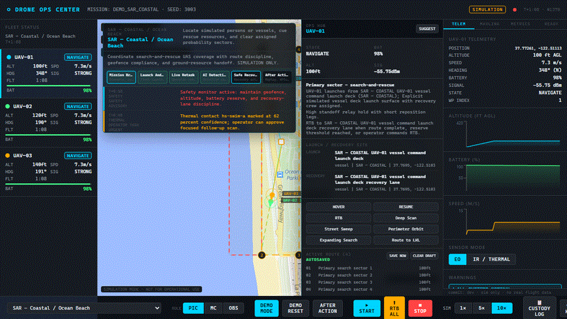

# Autonomous Drone Mission Simulator

**Simulation-only, web-first, with an optional Windows classroom desktop
host. No real aircraft or aviation-system control.**

A local-first, high-fidelity React and TypeScript training simulator for supervised,
multi-drone public-safety missions: plan, preflight, launch, retask, detect,
recover, replay, and export without connecting to aircraft, FAA/LAANC/USS/UTM,
Remote ID, dispatch, or camera systems.



| Experience | Public entry |
|---|---|
| Mobile web | [Launch Mobile](https://autonomous-drone-simulator-mobile.vercel.app/) |
| Windows web | [Launch Windows](https://autonomous-drone-simulator.vercel.app/) |
| Classroom client showcase | [Open Classroom](https://autonomous-drone-simulator-classroom.vercel.app/) |

Public availability is not proof that a release gate passed. Each deployed
target exposes its version, target, and Git SHA through `/build-info.json` and
the in-app build display; use those values when reporting a verified release.

## Product scope

- **31 scenarios:** 25 incident missions and 6 NIST-inspired skills drills.
- **Deterministic operations:** fixed-timestep simulation, seeded randomness,
  replay, and hash-chained evidence.
- **Multi-aircraft command:** fleets of three to eight aircraft, route
  planning, launch/recovery sites, sorties, recharge, retasking, hover, divert,
  resume, and return-to-base.
- **Realism fixtures:** frozen weather, airspace, terrain, building, GNSS, RF,
  thermal, SAR probability-of-detection, turbulence, and battery inputs for
  covered scenarios.
- **Training records:** tamper-evident JSONL application event record,
  KML, GeoJSON, replay, mission
  report, and after-action exports.
- **Local-first accounts:** password-derived encryption and browser-local
  IndexedDB records. Accounts do not synchronize across browsers, devices, or
  deployment origins.
- **Three targets, one simulation contract:** Mobile may render less geometry,
  but Windows, Mobile, and Classroom use identical simulation inputs and math.
- **Optional connected classroom:** a Windows instructor host runs the local relay;
  students join from Windows browsers on the approved school LAN.

The six skills drills are educational simulations, not official NIST
apparatus, certification, accreditation, or a standards-conformance claim.

## Scenario catalog

| Group | Count | Examples |
|---|---:|---|
| Training and refreshed incidents | 15 | coastal SAR, wildfire, maritime SAR, mountain SAR, flood corridor |
| Historical disaster simulations | 10 | Oso SR 530, Camp Fire, Helene, Surfside, Harvey, Katrina |
| NIST-inspired skills | 6 | open, obstructed, confined, night acuity, maritime, urban mask |

Canonical IDs and grouping live in
`src/scenarios/scenarioManifest.ts`. Scenario inputs are frozen at author time;
the runtime does not fetch live weather, airspace, terrain, traffic, or
incident data.

## Run locally

Required toolchain:

- Node.js 24.x
- npm 11.12.1

```bash
npm ci
npm run dev
```

Open `http://127.0.0.1:5173/`. Add `?map=fallback` when external map tiles are
unavailable; the fallback preserves tactical operation but is not a
geographic basemap replacement.

The local development server selects a presentation from device heuristics.
Use the explicit build scripts to qualify a shipping target.

## Classroom use

The hosted Classroom URL demonstrates account, instructor, student, and
coordinator interfaces. It cannot provide the long-lived LAN relay.

For licensed Windows-host development:

```bash
npm ci
npm run classroom:desktop
```

The Windows host requires the independent licensing-service public configuration
and an issued evaluator code; see
[`docs/EVALUATOR_LICENSING_RUNBOOK.md`](docs/EVALUATOR_LICENSING_RUNBOOK.md).
The host owns the local relay and shutdown lifecycle. It generates a
persistent 3072-bit RSA school-local CA plus a renewable LAN leaf certificate,
serves HTTPS/WSS, and fingerprint-pins its owned loopback relay. Relay-owned
instructor sessions, protocol-v3 single-use join capabilities, reconnect grace,
and fingerprint-pinned join links/QR are also implemented.

The relay rejects insecure non-loopback create/join traffic by default. An
explicit insecure development override must never be used for a school pilot.
Application payload encryption protects sealed student/instructor messages;
it does not hide network addresses, connection timing, message sizes,
availability, or all roster metadata.

Read [CLASSROOM_ADMIN.md](CLASSROOM_ADMIN.md) before provisioning or running a
class. Security and data boundaries are documented in
[SECURITY_THREAT_MODEL.md](SECURITY_THREAT_MODEL.md) and
[DATA_PRIVACY_RETENTION.md](DATA_PRIVACY_RETENTION.md).

The host does not install its CA into student Windows certificate stores.
School administrators must deploy only the exported CA certificate through
their approved device-management process. A public classroom installer is not
promoted until that trust installation and a real two-machine HTTPS/WSS smoke
are proven, the organization supplies a Windows code-signing certificate, and
the signed release-candidate checklist passes.

## Verification

Run the release gate from a clean checkout:

```powershell
$releaseSha = git rev-parse HEAD
npm ci
npm run verify:ci
npm run build:windows
npm run build:info -- --target windows --sha $releaseSha
npm run build:mobile
npm run build:info -- --target mobile --sha $releaseSha
npm run build:classroom
npm run build:info -- --target classroom --sha $releaseSha
npm run assert:bundles
npm run assert:fixtures
npm run assert:target-parity
npm run assert:training-scope
npm audit --audit-level=high
```

`verify:ci` runs type checking, expanded lint, the full test suite with at most
two workers, and fatal coverage thresholds. The remaining checks explicitly
build every target, inspect bundle isolation and fixture budgets, compare
deterministic target output, and reject high/critical dependency findings.
The training-scope assertion also rejects any reintroduction of legacy
operational modes or operational-launch enablement fields.

Do not describe the gate as green unless every command completed for the exact
reported SHA. Current release state and known blockers belong in
[PROJECT_STATUS.md](PROJECT_STATUS.md).

## Architecture

The production loop is deterministic and synchronous once scenario terrain is
prepared. Scenario selection, quick demo, custom missions, and classroom
assignment prepare declared terrain before fleet initialization. Missing
declared terrain blocks launch rather than silently substituting a flat
surface.

Presentation targets may differ in layout, controls, and 3D rendering.
Simulation modules, scenario data, decisions, scoring, events, and replay
hashes may not vary by target. The artifact parity harness enforces that
boundary.

Further engineering rules and design detail:

- [Working rules](docs/WORKING_RULES.md)
- [Architecture notes](docs/ARCHITECTURE_NOTES.md)
- [Realism roadmap](docs/REALISM_ROADMAP.md)
- [Project status](PROJECT_STATUS.md)

## Deployment and releases

Pull requests may use Vercel preview deployments. Production promotion is
designed to run only after CI succeeds on the exact `main` SHA:

1. CI qualifies the code, coverage, dependencies, fixtures, parity, and three
   target builds.
2. The production workflow confirms `main` still equals the successful CI SHA.
3. Protected per-project Vercel Deploy Hooks build that revision.
4. The workflow verifies `/build-info.json` on every public alias.

Before enabling `.github/workflows/deploy.yml`, disable unverified automatic
production deployment in the three Vercel projects and configure protected
production environments plus `VERCEL_WINDOWS_DEPLOY_HOOK`,
`VERCEL_MOBILE_DEPLOY_HOOK`, and `VERCEL_CLASSROOM_DEPLOY_HOOK` secrets.

Tagged Windows releases re-run the complete gate, require signing credentials,
package the classroom host, generate checksums and an SBOM, attest provenance,
and create a GitHub release or prerelease according to the semantic version.
Manual workflow dispatch also requires signing credentials and stages a review
artifact without publishing it. Unsigned packages are local engineering
artifacts only.

See [RELEASE_CHECKLIST.md](RELEASE_CHECKLIST.md),
[Windows signing runbook](docs/WINDOWS_SIGNING_RUNBOOK.md),
[CHANGELOG.md](CHANGELOG.md), and [THIRD_PARTY_NOTICES.md](THIRD_PARTY_NOTICES.md).

## Safety, privacy, and limitations

- This software is not certified or intended for real aviation,
  public-safety, dispatch, regulatory authorization, or emergency operations.
- Regulatory, Remote ID, LAANC-style, and Scripted Airspace & Traffic surfaces
  are scripted training layers in every build.
- The shared training-assurance contract is integrated into classroom and
  Windows pilot paths. No mode creates real data connections, FAA
  authorization, real-mission validation, route-safety proof,
  obstacle-avoidance guarantees, forensic evidence, or blanket compliance. See
  [Agency training assurance](docs/AGENCY_TRAINING_ASSURANCE.md).
- Map tiles normally come from a third party and may expose ordinary request
  metadata to that provider.
- Thermal behavior models detection constraints; it does not generate
  radiometric imagery or absolute-temperature maps.
- Replay storage is bounded and is not a flight-data recorder.
- Local encryption does not protect an unlocked device, compromised browser,
  malicious extension, screen capture, keylogger, or exported plaintext file.
- The optional classroom host generates a school-local certificate but does
  not install trust on student devices. It still requires an approved private
  network, managed CA installation, retention policy, administrator ownership,
  and supervised roster.
- No independent penetration test, accessibility certification, legal
  compliance attestation, or institution pilot is implied by repository tests.

Assurance and administration references:

- [Security threat model](SECURITY_THREAT_MODEL.md)
- [Data privacy and retention](DATA_PRIVACY_RETENTION.md)
- [Incident response](INCIDENT_RESPONSE.md)
- [Accessibility status](ACCESSIBILITY.md)

## License

This repository is publicly viewable under its source-available proprietary
[LICENSE](LICENSE). It is not open source. Third-party components retain their
own licenses.
